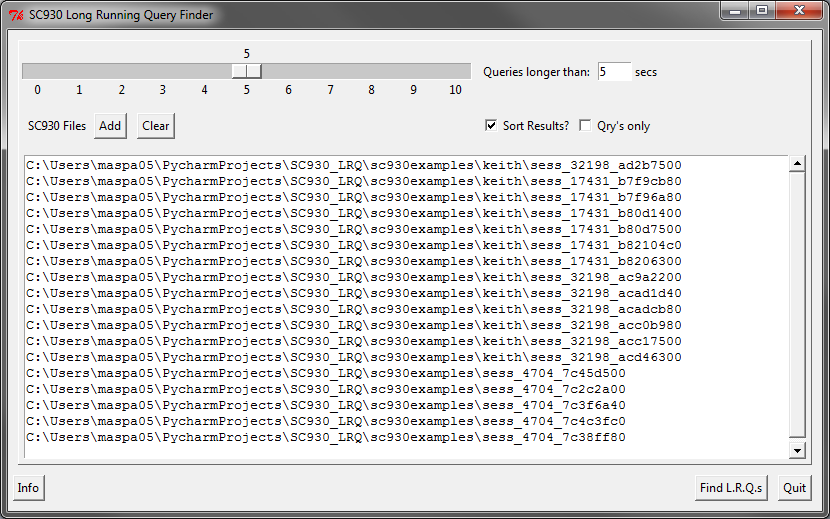
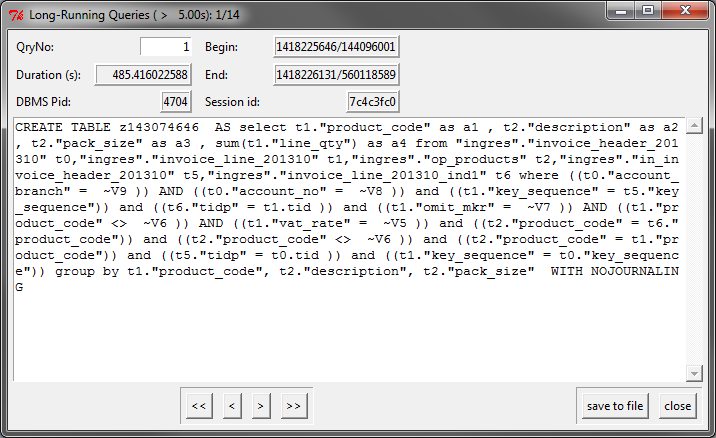

# SC930 LRQ

This is a Python program to find long-running queries (LRQs) from SC930 logs. It's similar to the AWK script *sc930_long_qry.awk* (see [awk version](awk_version)) in purpose although hopefully a little nicer to use.

Current version is 0.15

## Requirements

The script was written for Python 2.7. It's not currently compatible with Python 3. I've tested it with Python 2.6 but no earlier.

There's an (optional) GUI written in Tkinter. Tk is not the most polished framework but it should be easily available anywhere python is so I chose it for that reason. If Ttk is also installed (Tk 8.5 and later) then it should look slightly nicer.

The program attempts to detect whether these are installed and fall back gracefully to either Tk alone or a CLI mode.

## To Use

### CLI mode

    SC930_LRQ.py <-n> <-r> <-q> <-t time> <-d> <-e> <-c csvfilename> <filename> [<filename>...]

The flags mean:

**-n** do NOT sort results (by default they are sorted longest to shortest)

**-d** sort in order of query start timestamp, default earliest time to latest

**-e** sort in order query end timestamp, default earliest time to latest

**-r** reverse default sort order

**-c** produce output into a named CSV file instead of standard output

**-t** specify a time threshold in seconds, queries longer than this are considered LRQs

**-q** "queries only" i.e. only SC930 records QRY, REQUERY, QUEL and REQUEL.

Multiple files can be specified. The DBMS pid and SESSION id of the LRQ will be taken from the filename. If the filename is not in the original format then this may not work.

User id that executed the query and database name that was executed within are also added to every record, if we can find the "session begin" record that contains this information.
Also, cursor id data is added to Fetch, Close and Add cursor statements, to aid in tracing query flow.

Results are stored in memory before output. For sufficiently large files and/or low enough time thresholds this may be a lot of memory, the -n option will reduce this if necessary.

### GUI mode

If run without any parameters (and Tkinter is installed) SC930_LRQ will start in GUI mode:

The slider and entry field at the top show the time threshold. This can be adjusted using the mouse or left and right keys, or by typing in the field. Changing the slider should update the field and vice-versa. The slider's scale will automatically adjust as you near the ends.

Use the **Add** button to add to the file list and the **Clear** button to empty it. This allows you to add files from multiple directories if necessary.

The **Sort Results** check box specifies whether to sort the results. Qry's only limits the results to only query records as with -q in the CLI mode.

Use the **Find L.R.Q.s** button to begin execution.

The results may take some time to find as each file must be processed in turn and they may be large. As the files are scanned a progress bar will be shown.

The results are shown in a "card index" style interface.

The **<<**, **<**, **>** and **>>** buttons are used to go to the first, previous, next and last query respectively. You can also type in the QryNo field to jump to a particular query. The current query is shown in the window title.
The two lines above the query box show a representation of the time-line. The black line is the overall timescale (earliest start query time to latest end time), and the red line represents the current query.

The **save to file** button writes the LRQs to a file in a format similar to the CLI output.

## example output

    Query:      select resolve_table( ~V ,  ~V )
    Begin:      1418810159/409273829
    End:        1418810159/409273830
    Duration:   0000000000.000000001 secs
    DBMS PID:   11236
    Session ID: 2d3c560
    User ID:    tester
    Database name: testdb

    Query:      select resolve_table( ~V ,  ~V )
    Begin:      1418810159/419273865
    End:        1418810159/419273866
    Duration:   0000000000.000000001 secs
    DBMS PID:   11236
    Session ID: 2d3c560
    User ID:    tester
    Database name: testdb

    Found 314 queries that took longer than  0.000000 seconds

## Windows installer package

If you have Python installed you can run the program as above. However for convenience an MSI installer package is [available](windows). This will install two versions of the program - SC930_LRQ.exe and SC930_LRQ_gui.exe. The first of these works as described above i.e. CLI if used with arguments, GUI if not. However in GUI mode a command prompt window will appear. SC930_LRQ_gui.exe will launch into the GUI without the command prompt window and thus can be used for shortcuts.
